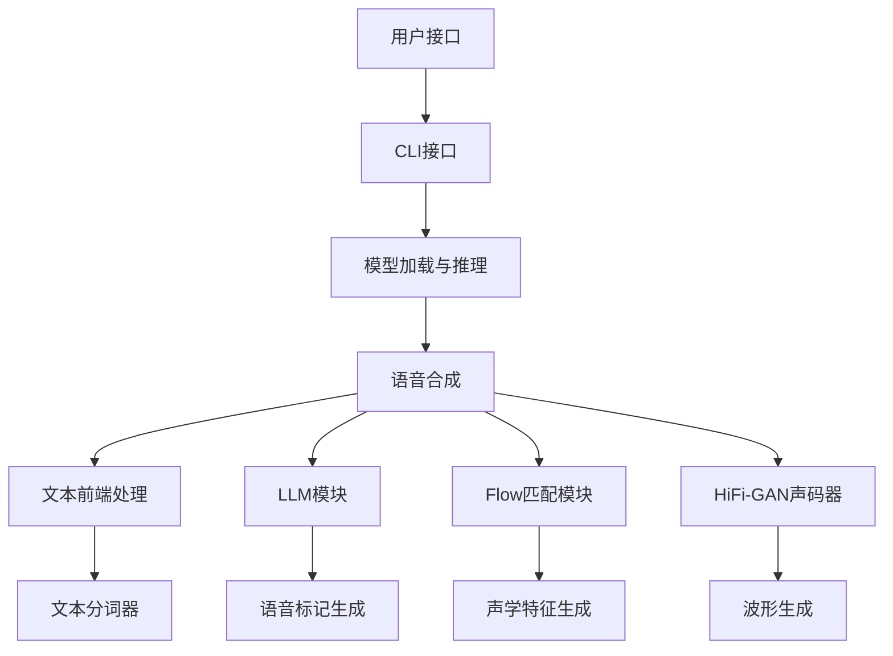

# CosyVoice项目架构概览

## 1. 项目简介

CosyVoice是一个开源的语音合成大模型项目，专注于提供高质量的文本到语音转换功能。该项目由阿里巴巴开发并开源，目前已经发布了2.0版本。

CosyVoice具有以下特点：
- 多语言支持：中文、英语、日语、韩语以及中国多种方言
- 跨语言和混合语言支持
- 低延迟双向流式合成
- 高精度发音和稳定的音色
- 自然的语音合成体验

## 2. 项目整体架构

```
CosyVoice/
├── asset/                    # 资源文件目录
├── cosyvoice/                # 核心模块
│   ├── bin/                  # 二进制工具
│   ├── cli/                  # 命令行接口
│   ├── dataset/              # 数据集处理
│   ├── flow/                 # 流匹配模型
│   ├── hifigan/              # HiFi-GAN声码器
│   ├── llm/                  # 大语言模型
│   ├── tokenizer/            # 文本分词器
│   ├── transformer/          # Transformer模型
│   └── utils/                # 工具函数
├── docker/                   # Docker部署相关
├── examples/                 # 示例代码
├── runtime/                  # 运行时环境
├── third_party/              # 第三方依赖
├── tools/                    # 工具脚本
├── webui.py                  # Web界面
└── requirements.txt          # 依赖列表
```

## 3. 核心模块依赖关系



## 4. 功能模块调用逻辑

### 4.1 基础流程

1. **文本输入** → **文本前端处理**
   - 文本规范化
   - 文本分词
   - 特殊标记处理

2. **语音合成核心流程**
   - LLM模块：生成语音标记序列
   - Flow匹配模块：将语音标记转换为声学特征（Mel频谱）
   - HiFi-GAN声码器：将声学特征转换为波形

3. **模型推理模式**
   - 预训练音色模式 (SFT)
   - 零样本复刻模式 (Zero-shot)
   - 跨语种复刻模式 (Cross-lingual)
   - 自然语言控制模式 (Instruct)

### 4.2 CosyVoice推理流程

1. **初始化**
   - 加载配置文件
   - 初始化前端处理器和模型组件
   - 设置采样率和优化参数

2. **文本处理**
   - 文本规范化和分割
   - 根据模式生成不同的前端输入

3. **模型推理**
   - 多线程LLM推理
   - 标记到波形转换
   - 增强后处理

4. **流式输出**
   - 支持流式和非流式输出
   - 缓存管理和音频平滑处理

## 4. 功能模块调用逻辑详解

### 4.3 推理模式详细介绍

#### 4.3.1 预训练音色模式 (SFT)

预训练音色模式是使用已经预训练好的音色进行语音合成：

1. **工作原理**
   - 从预训练模型中选择特定说话人ID
   - 使用对应的音色嵌入向量作为条件输入
   - 不需要额外的参考音频

2. **调用流程**
   - 文本预处理和分词
   - 加载预训练的音色嵌入向量
   - LLM直接生成语音标记序列
   - Flow模型转换为声学特征
   - HiFi-GAN生成最终音频波形

3. **关键代码**
   ```python
   # frontend_sft函数实现
   def frontend_sft(self, tts_text, spk_id):
       tts_text_token, tts_text_token_len = self._extract_text_token(tts_text)
       embedding = self.spk2info[spk_id]['embedding']
       model_input = {
           'text': tts_text_token, 
           'text_len': tts_text_token_len, 
           'llm_embedding': embedding, 
           'flow_embedding': embedding
       }
       return model_input
   ```

#### 4.3.2 零样本复刻模式 (Zero-shot)

零样本复刻是CosyVoice的核心功能，只需短短几秒的参考音频即可复制任何声音：

1. **工作原理**
   - 从参考音频中提取音色特征和语音标记
   - 使用参考文本帮助模型理解音频内容
   - 模型学习参考音频的音色特征并应用到新文本

2. **调用流程**
   - 参考音频预处理和特征提取
   - 文本和参考文本预处理
   - 提取说话人嵌入向量
   - LLM生成带有参考音色的语音标记
   - Flow模型生成保持音色的声学特征
   - HiFi-GAN合成最终音频

3. **关键代码**
   ```python
   # frontend_zero_shot函数实现
   def frontend_zero_shot(self, tts_text, prompt_text, prompt_speech_16k, resample_rate):
       tts_text_token, tts_text_token_len = self._extract_text_token(tts_text)
       prompt_text_token, prompt_text_token_len = self._extract_text_token(prompt_text)
       prompt_speech_resample = torchaudio.transforms.Resample(
           orig_freq=16000, new_freq=resample_rate)(prompt_speech_16k)
       speech_feat, speech_feat_len = self._extract_speech_feat(prompt_speech_resample)
       speech_token, speech_token_len = self._extract_speech_token(prompt_speech_16k)
       embedding = self._extract_spk_embedding(prompt_speech_16k)
       
       model_input = {
           'text': tts_text_token, 'text_len': tts_text_token_len,
           'prompt_text': prompt_text_token, 'prompt_text_len': prompt_text_token_len,
           'llm_prompt_speech_token': speech_token, 'llm_prompt_speech_token_len': speech_token_len,
           'flow_prompt_speech_token': speech_token, 'flow_prompt_speech_token_len': speech_token_len,
           'prompt_speech_feat': speech_feat, 'prompt_speech_feat_len': speech_feat_len,
           'llm_embedding': embedding, 'flow_embedding': embedding
       }
       return model_input
   ```

#### 4.3.3 跨语种复刻模式 (Cross-lingual)

跨语种复刻允许将一种语言的声音用于合成另一种语言的文本：

1. **工作原理**
   - 基于零样本复刻模式进行扩展
   - 移除LLM模块中的参考文本和语音标记
   - 保留Flow模块中的参考特征

2. **调用流程**
   - 参考音频预处理（不需要参考文本）
   - 目标文本预处理（与参考音频语言不同）
   - 提取音色嵌入向量
   - LLM在无参考的情况下生成新语言的语音标记
   - Flow模块保持音色特征
   - HiFi-GAN合成最终音频

3. **关键代码**
   ```python
   # frontend_cross_lingual函数实现
   def frontend_cross_lingual(self, tts_text, prompt_speech_16k, resample_rate):
       model_input = self.frontend_zero_shot(tts_text, '', prompt_speech_16k, resample_rate)
       # 在跨语言模式下，移除LLM中的参考信息
       del model_input['prompt_text']
       del model_input['prompt_text_len']
       del model_input['llm_prompt_speech_token']
       del model_input['llm_prompt_speech_token_len']
       return model_input
   ```

#### 4.3.4 自然语言控制模式 (Instruct)

自然语言控制模式允许通过文本指令控制语音的风格和情感：

1. **工作原理**
   - 使用预训练音色作为基础
   - 添加自然语言指令来控制合成风格
   - CosyVoice和CosyVoice2有不同的实现

2. **调用流程**
   - 文本和指令文本预处理
   - 加载预训练音色嵌入向量
   - LLM根据指令和文本生成语音标记
   - Flow模块生成声学特征
   - HiFi-GAN合成最终音频

3. **关键代码**
   ```python
   # CosyVoice中的frontend_instruct实现
   def frontend_instruct(self, tts_text, spk_id, instruct_text):
       model_input = self.frontend_sft(tts_text, spk_id)
       # 在instruct模式中，移除LLM中的说话人嵌入向量以防信息泄漏
       del model_input['llm_embedding']
       instruct_text_token, instruct_text_token_len = self._extract_text_token(instruct_text + '<endofprompt>')
       model_input['prompt_text'] = instruct_text_token
       model_input['prompt_text_len'] = instruct_text_token_len
       return model_input
   ```

## 5. 零样本复刻模式详解与自定义声色实现

### 5.1 零样本复刻技术原理

零样本复刻是CosyVoice的核心能力，它能够通过短短几秒的音频样本捕获说话人的声音特征，并应用到任何新文本上：

1. **音色特征提取机制**
   - CAMPPlus模型：提取全局说话人嵌入向量（dim=192）
   - 语音标记器：将音频转换为离散标记序列
   - 声学特征提取：生成频谱图表示

2. **音色迁移技术**
   - LLM理解参考音频与文本的对应关系
   - 保留说话人特征并迁移到新内容
   - 通过Flow匹配实现平滑过渡

3. **技术优势**
   - 低资源需求：仅需3秒语音样本
   - 跨语言能力：支持多语种间迁移
   - 音色稳定性：双重特征保证音色一致
   - 高质量合成：自然度和表现力强

### 5.2 自定义声色预训练流程

如果需要更稳定和个性化的结果，可以通过以下步骤预训练自己的声色模型：

1. **数据准备**
   - 收集30分钟以上的高质量语音样本
   - 准备精确的文本标注
   - 控制录音环境和音质
   - 文本内容应尽量多样化

2. **数据预处理**
   - 分割成5-15秒的短语音片段
   - 格式化为标准数据结构（wav.scp/text/utt2spk/spk2utt）
   - 提取说话人嵌入向量和语音标记
   - 转换为模型训练所需的parquet格式

3. **模型训练配置**
   - 调整配置文件参数：
     ```yaml
     padding:
       use_spk_embedding: True  # SFT模式下必须设为True
     
     train_conf:
       optim_conf:
         lr: 1e-5  # 微调时使用较小学习率
       scheduler: constantlr  # 使用恒定学习率
     ```

4. **训练过程**
   - 分阶段训练三个核心模块：
     1. LLM模块：负责语音标记生成
     2. Flow模块：负责声学特征生成
     3. HiFi-GAN声码器（可选）：负责波形生成

5. **模型评估与优化**
   - 使用MOS评分评估合成质量
   - 检查音色相似度和稳定性
   - 根据评估结果调整参数

6. **模型导出与部署**
   - 平均多个检查点获得最终模型
   - 转换为生产环境可用格式
   - 集成到应用系统中

### 5.3 零样本复刻实践建议

1. **参考音频选择**
   - 选择3-10秒清晰无噪音的音频片段
   - 避免过多背景噪音和混响
   - 语速和情感应适中，避免极端状态

2. **参考文本准备**
   - 参考文本必须与参考音频内容一致
   - 文本长度适中，不要过长或过短
   - 确保标点符号和语句结构正确

3. **合成效果优化**
   - 调整speed参数控制语速
   - 使用流式模式实现实时合成
   - 对长文本进行分段处理

4. **多语言应用**
   - 跨语种合成时，可以使用语言标记增强效果
   - 中英混合文本需特别注意发音自然度
   - 使用`<|zh|>`, `<|en|>`, `<|jp|>`, `<|yue|>`, `<|ko|>`等标记指定语言

## 6. 模型结构与技术细节

CosyVoice的核心技术架构由三个主要组件构成，它们共同协作完成从文本到语音的转换：

1. **LLM模块**
   - 将文本转换为语音标记序列
   - 支持零样本和跨语言场景
   - 使用自回归生成

2. **Flow匹配模块**
   - 将语音标记转换为声学特征（Mel频谱）
   - 支持流式生成
   - 使用非自回归生成，提高速度

3. **HiFi-GAN声码器**
   - 将声学特征转换为高质量波形
   - 快速生成，低计算开销

## 7. 部署与服务化

CosyVoice提供多种部署方式：

1. **本地Python环境**
   - 直接安装依赖并运行
   - 支持CPU和GPU推理

2. **Docker容器**
   - 提供Docker构建脚本
   - 支持gRPC和FastAPI服务

3. **Web界面**
   - 基于Gradio实现的可视化界面
   - 支持多种推理模式和参数调整

## 8. 项目扩展点

1. **模型训练**
   - 支持自定义数据集训练
   - 模型微调和SFT

2. **推理优化**
   - TensorRT加速
   - JIT编译优化
   - 半精度(FP16)推理

3. **新功能扩展**
   - 情感控制
   - 方言和口音调整
   - 与LLM系统集成

## 9. 性能指标

- **延迟**: 支持低至150ms的首包合成延迟
- **稳定性**: 跨语言和零样本场景下的音色一致性
- **准确性**: 与CosyVoice 1.0相比，发音错误率降低30%-50%
- **自然度**: MOS评分从5.4提升到5.53

## 10. 关键依赖

- PyTorch和TorchAudio: 深度学习框架
- ONNX和TensorRT: 模型优化和推理加速
- Gradio: Web界面实现
- Librosa: 音频处理
- WeTextProcessing/ttsfrd: 文本规范化处理 